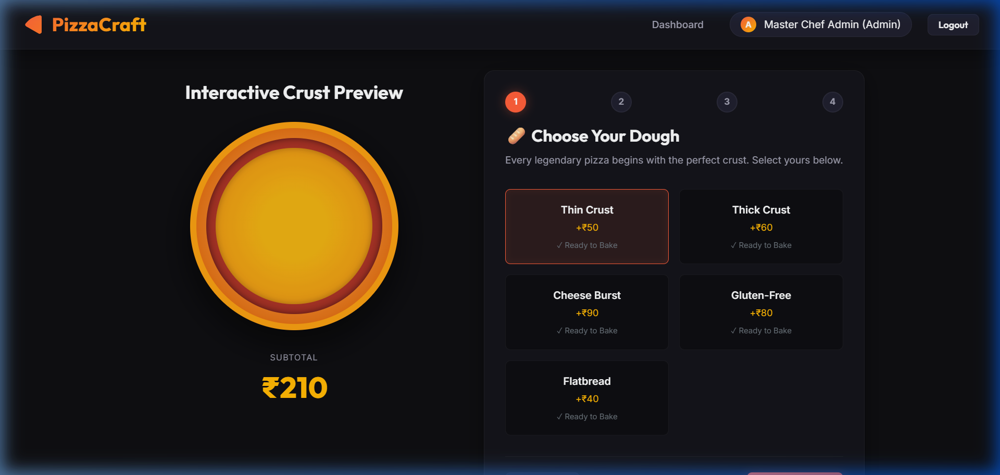
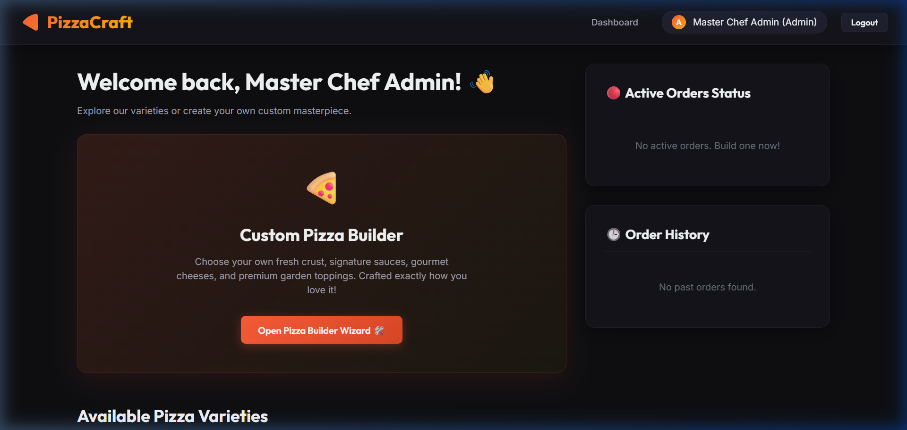
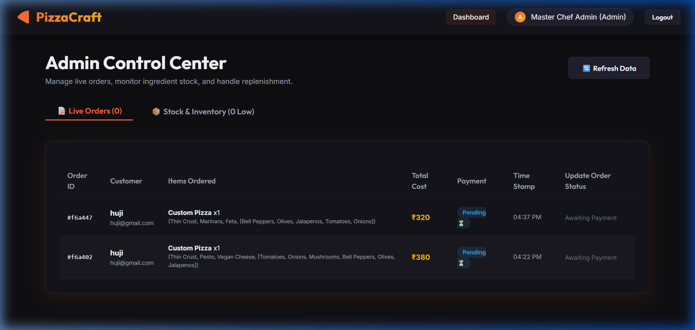
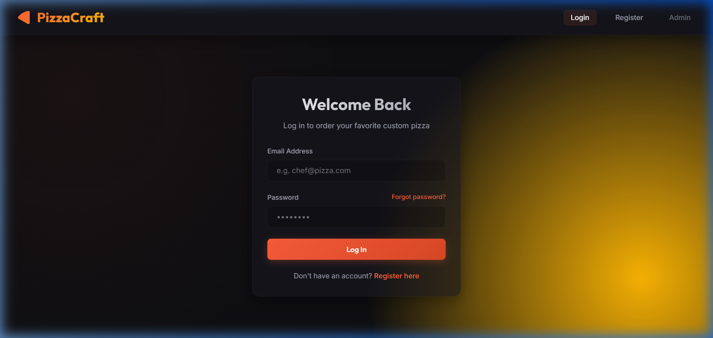

# 🍕 PizzaCraft

> An immersive, production-grade custom pizza builder and inventory management platform. Built with MongoDB, Express, React (Vite), Node.js (MERN stack), integrated with Socket.io for real-time tracking, Razorpay checkout, and node-cron for automated stock management.

---

## 📸 Platform Screenshots

### 1. Immersive Custom Pizza Builder
*Build your master pizza step-by-step with coordinate-mapped toppings scattering dynamically on a visual canvas and live subtotal calculations.*


### 2. User Dashboard & Live Status Tracking
*Select from curated varieties, order custom items, and watch cooking status updates (`Order Received` → `In Kitchen` → `Sent to Delivery`) in real-time.*


### 3. Administrative Control Center
*Manage incoming customer order statuses with dropdown controls and view live stock levels with automated low-stock warnings.*


### 4. Portals & Secure Authentication
*Separate secure login portals for users and admin accounts.*
<p align="center">
  
  
</p>

---

## ⚡ Key Features

### 👤 User Experience
* **Secure Auth**: JSON Web Token (JWT) session authorization with password hashing (`bcryptjs`).
* **Email Verification & Resets**: Double-opt-in email registration verify flow and password resets via `nodemailer`.
* **Interactive Pizza Builder**: 4-Step custom constructor (Crust 🥖 → Sauce 🥫 → Cheese 🧀 → Toppings 🥗) with live stock checking.
* **Razorpay Checkout**: Seamless sandboxed payment popup integration. Includes a **local checkout simulator** if keys are omitted.
* **Real-Time Timelines**: Live status update timelines reflecting active chef operations via WebSockets.

### 👑 Administrative Operations
* **Separate Admin Login**: Dedicated, decoupled portal for personnel (`/admin/login`).
* **Live Orders Panel**: Dynamic dashboard showing customer receipts, totals, and timestamps. Features audio chimes when new customer orders are received.
* **Inventory Control**: Categorized grid of bases, sauces, cheeses, and toppings with warning thresholds and inline stock updates.
* **Automated Low-Stock Alerts**: Background `node-cron` daemon checking stock limits every minute and emailing alert warnings to admins.

---

## 🛠️ Tech Stack & Dependencies

* **Frontend**: React (Vite), React Router DOM, Socket.io Client, Vanilla CSS (with Glassmorphic design).
* **Backend**: Node.js, Express.js, MongoDB (Mongoose), Socket.io, Razorpay Node SDK, Nodemailer, Node-cron.

---

## 🚀 Setting Up the Project

### 1. Clone & Bootstrap
Install all root, backend, and frontend dependencies concurrently:
```bash
npm run install-all
```

### 2. Configure Environment Variables
Create a `.env` file in the `backend/` directory (you can copy values from `backend/.env.example`):
```env
PORT=5000
MONGODB_URI=your_mongodb_atlas_connection_string
JWT_SECRET=your_jwt_session_secret
FRONTEND_URL=http://localhost:5173
ADMIN_EMAIL=admin@pizza.com
STOCK_ALERT_THRESHOLD=20

# Razorpay Keys
RAZORPAY_KEY_ID=your_razorpay_key_id
RAZORPAY_KEY_SECRET=your_razorpay_key_secret

# SMTP Settings (Optional, falls back to Ethereal email simulator if blank)
SMTP_HOST=
SMTP_PORT=
SMTP_USER=
SMTP_PASS=
```

And in the `frontend/` directory, create a `.env` file containing:
```env
VITE_API_URL=http://localhost:5000
```

### 3. Launch Development Servers
Run the backend API server and Vite frontend compiler concurrently using a single command:
```bash
npm run dev
```

*Note: On the first successful database boot, the backend will **automatically seed** the initial ingredients, pre-configured variety recipes, and default admin user account.*

---

## 🔑 Default Credentials
* **User Profile**: Register any new account at `http://localhost:5173/register` and check server logs for your local verification email link.
* **Admin Profile**:
  * **Email**: `admin@pizza.com`
  * **Password**: `AdminPassword123`
